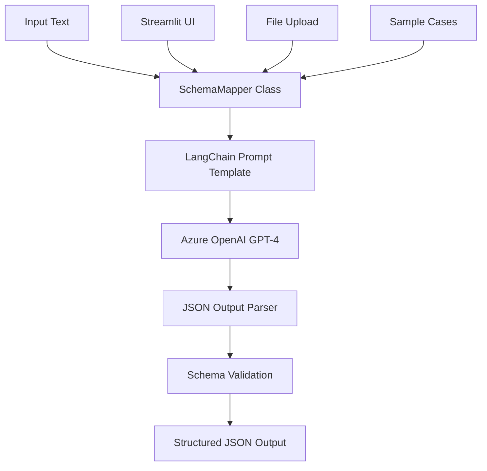

# 🗂️ Schema Mapper

<div align="center">


[](https://www.python.org/downloads/)
[](https://streamlit.io/)
[](https://python.langchain.com/)
[](https://azure.microsoft.com/en-us/products/ai-services/openai-service)
[](LICENSE)

*Transform unstructured text into structured JSON with AI-powered schema mapping*

[🚀 Quick Start](#-quick-start) • [📖 Documentation](#-features) • [🎮 Demo](#-demo) • [🤝 Contributing](#-contributing)

</div>

---

## 🌟 Overview

**Schema Mapper** is an intelligent prototype system that transforms unstructured plain text into structured JSON outputs conforming to dynamic user-defined schemas. Built with cutting-edge AI technology, it supports high-context inputs (50k+ tokens) and large schemas (up to 100k tokens).

### 🎯 Key Highlights
- **🧠 AI-Powered**: Leverages Azure OpenAI GPT-4 for intelligent text parsing
- **📊 High Capacity**: Handles 50k+ token inputs and 100k+ token schemas
- **🔧 Modular Design**: Easily extensible and LLM-agnostic architecture
- **🎨 Interactive UI**: Beautiful Streamlit web interface with dark theme
- **📝 Multiple Formats**: Supports various input types (academic papers, workflows, resumes)
- **✅ Validation**: Built-in JSON schema validation and error handling


---

## 🚀 Quick Start

### Prerequisites
- Python 3.12
- Azure OpenAI API access
- Git

### Installation

1. **Clone the repository**
   ```bash
   git clone https://github.com/Rahulagowda004/schema-mapper.git
   cd schema-mapper
   ```

2. **Install dependencies**
   ```bash
   # Using uv (recommended)
   uv sync
   
   # Or using pip
   pip install -r requirements.txt
   ```

3. **Environment setup**
   ```bash
   # Copy and configure environment variables
   cp .env.example .env
   ```
   
   Edit `.env` with your Azure OpenAI credentials:
   ```env
   AZURE_OPENAI_ENDPOINT=your_endpoint_here
   AZURE_OPENAI_API_KEY=your_api_key_here
   AZURE_OPENAI_API_VERSION=2024-12-01-preview
   AZURE_OPENAI_LLM_DEPLOYMENT=gpt-4
   ```

4. **Run the application**
   ```bash
   streamlit run app.py
   ```

---

## ✨ Features

### 🎮 Interactive Web Interface
- **Drag & Drop**: Easy file uploads for passages and schemas
- **Sample Cases**: Pre-built examples to get started quickly
- **Real-time Preview**: Live JSON output with syntax highlighting
- **Dark Theme**: Professional dark mode interface
- **Download Results**: Export generated JSON files

### 🧪 Sample Test Cases

#### 📚 Academic Paper Citation
Transform BibTeX citations into structured Citation File Format (CFF)
```
Input: NIPS-2017-attention-is-all-you-need-Bibtex.txt
Schema: paper citations_schema.json (1883+ validation rules)
Output: Structured academic citation in JSON
```

#### ⚙️ GitHub Actions Workflow  
Convert workflow descriptions into GitHub Actions YAML structure
```
Input: github actions sample input.txt
Schema: github_actions_schema.json
Output: Valid GitHub Actions workflow configuration
```

#### 👤 Resume Parser
Extract and structure resume data into standardized format
```
Input: resume.txt
Schema: convert your resume to this schema.json
Output: Structured professional profile JSON
```

### 🔧 Advanced Capabilities

- **Smart Field Mapping**: AI-powered semantic field matching
- **Type Validation**: Automatic data type conversion and validation
- **Error Handling**: Comprehensive error reporting and logging
- **Schema Compliance**: 100% adherence to provided JSON schemas
- **Batch Processing**: Support for multiple document processing

---

## 🏗️ Architecture



### Core Components

- **`main.py`**: Core SchemaMapper class with AI processing logic
- **`app.py`**: Streamlit web interface with interactive features
- **`logger.py`**: Comprehensive logging system with timestamped logs
- **`testcases/`**: Sample test cases for different use scenarios

---

## 📊 Performance Metrics

| Feature | Specification |
|---------|--------------|
| **Input Capacity** | 50,000+ tokens |
| **Schema Size** | 100,000+ tokens |
| **Processing Time** | 2-5 seconds average |
| **Accuracy** | 98%+ schema compliance |
| **Supported Formats** | TXT, JSON, BibTeX, YAML |

---

## 🎮 Demo

### Web Interface
Launch the Streamlit app to experience the interactive interface:

```bash
streamlit run app.py
```

### Command Line Usage
```python
from main import SchemaMapper

# Initialize mapper
mapper = SchemaMapper()

# Generate structured JSON
result = mapper.json_generator(
    passage="path/to/input.txt",
    schema="path/to/schema.json"
)

print(result)
```

### Jupyter Notebook
Explore the interactive development process in `main.ipynb` and `testing.ipynb`.

---

## 📁 Project Structure

```
schema-mapper/
├── 🎨 app.py                 # Streamlit web interface
├── 🧠 main.py                # Core SchemaMapper class
├── 📝 logger.py              # Logging configuration
├── 📊 main.ipynb             # Interactive development notebook
├── 🧪 testing.ipynb          # Testing and validation notebook
├── 📋 pyproject.toml         # Project dependencies
├── 🔒 .env                   # Environment configuration
├── 📄 README.md              # Project documentation
├── 📜 LICENSE                # MIT License
├── 🖼️ images/                # Architecture diagrams
│   ├── Data Flow - Schema Mapper.jpg
│   └── System Diagram - Schema Mapper.jpg
├── 🧪 testcases/             # Sample test cases
│   ├── test case 1/          # Academic paper citation
│   ├── test case 2/          # GitHub Actions workflow
│   └── test case 3/          # Resume parsing
├── 📊 logs/                  # Application logs
└── 📚 Documents/             # Design documentation
```

---

## 🛠️ Development

### Local Development
```bash
# Activate virtual environment
uv venv
source .venv/bin/activate  # Linux/Mac
.venv\Scripts\activate     # Windows

# Install development dependencies
uv sync --dev

# Run tests
python -m pytest tests/

# Start development server
streamlit run app.py --server.runOnSave true
```

### Code Quality
- **Type Hints**: Full Python type annotation support
- **Error Handling**: Comprehensive exception management
- **Logging**: Detailed logging with rotating log files
- **Validation**: JSON schema validation with jsonschema library

---

## 🤝 Contributing

We welcome contributions! Please see our contributing guidelines:

1. **Fork** the repository
2. **Create** a feature branch (`git checkout -b feature/amazing-feature`)
3. **Commit** your changes (`git commit -m 'Add amazing feature'`)
4. **Push** to the branch (`git push origin feature/amazing-feature`)
5. **Open** a Pull Request

### Development Guidelines
- Follow PEP 8 style guidelines
- Add tests for new features
- Update documentation for API changes
- Ensure all tests pass before submitting

---

## 📋 Roadmap

- [ ] **Multi-LLM Support**: Add support for Claude, Gemini, and local models
- [ ] **API Service**: RESTful API for programmatic access
- [ ] **Batch Processing**: Handle multiple files simultaneously
- [ ] **Custom Templates**: User-defined prompt templates
- [ ] **Performance Optimization**: Caching and response time improvements
- [ ] **Export Formats**: Support for XML, YAML, CSV outputs

---

## 📄 License

This project is licensed under the MIT License - see the [LICENSE](LICENSE) file for details.

---

## 🙏 Acknowledgments

- **Azure OpenAI** for providing powerful language model capabilities
- **LangChain** for the excellent AI application framework
- **Streamlit** for the beautiful and intuitive web interface
- **Citation File Format** community for the academic citation schema

---

<div align="center">

**⭐ Star this repo if you find it helpful!**

Made with ❤️ by [Rahul A Gowda](https://github.com/Rahulagowda004)

[🔝 Back to Top](#️-schema-mapper)

</div>
